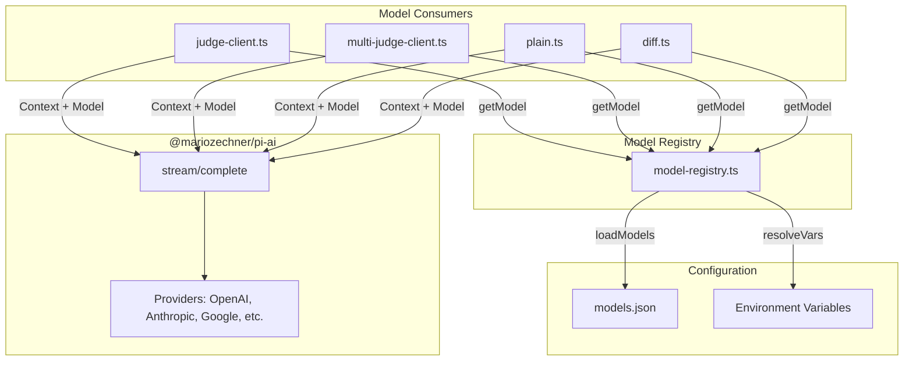

# Migration: Replace openai with @mariozechner/pi-ai

> **Note:** This spec has been superseded by [vsa-refactor.md](./vsa-refactor.md).
> The migration is now part of a larger VSA restructure. See that document for the complete plan.

## Goal

Replace the `openai` package with `@mariozechner/pi-ai` for better compatibility with various LLM endpoints. Migrate model definitions to `models.json` for user configurability.

## Why

- `pi-ai` supports multiple providers: OpenAI, Anthropic, Google, Azure, Bedrock, Mistral, Groq, etc.
- Unified API via `stream()` / `complete()` abstracts provider differences
- Users can configure models in `models.json` without code changes
- Single source of truth for model metadata (cost, context window, capabilities)

## Architecture

```
packages/eval/
├── models.json                    # Model definitions (user-editable)
├── src/
│   ├── utils/
│   │   ├── model-registry.ts      # NEW: Load/resolve models from models.json
│   │   ├── judge-client.ts        # REFACTOR: Use pi-ai stream()
│   │   └── multi-judge-client.ts  # REFACTOR: Use pi-ai stream()
│   ├── runners/
│   │   └── plain.ts               # REFACTOR: Use pi-ai stream()
│   └── scorers/
│       └── diff.ts                # REFACTOR: Use pi-ai stream()
```

## Data Flow



## models.json Schema

```json
{
  "$schema": "./models.schema.json",
  "models": {
    "<model-id>": {
      "id": "gpt-4o-mini",
      "name": "GPT-4o Mini",
      "api": "openai-completions",
      "provider": "openai",
      "baseUrl": "${OPENAI_BASE_URL}",
      "reasoning": false,
      "input": ["text", "image"],
      "cost": {
        "input": 0.15,
        "output": 0.6,
        "cacheRead": 0,
        "cacheWrite": 0
      },
      "contextWindow": 128000,
      "maxTokens": 16384,
      "headers": {
        "x-token": "${OPENAI_X_TOKEN}"
      }
    }
  }
}
```

### Field Descriptions

| Field | Type | Required | Description |
|-------|------|----------|-------------|
| `id` | string | yes | Model identifier (e.g., `gpt-4o-mini`) |
| `name` | string | yes | Human-readable name |
| `api` | string | yes | API type: `openai-completions`, `anthropic-messages`, etc. |
| `provider` | string | yes | Provider name: `openai`, `anthropic`, `google`, etc. |
| `baseUrl` | string | yes | API endpoint URL, supports `${VAR}` substitution |
| `reasoning` | boolean | no | Whether model supports extended thinking |
| `input` | string[] | no | Supported input types: `["text"]`, `["text", "image"]` |
| `cost` | object | no | Cost per million tokens |
| `contextWindow` | number | no | Max context length |
| `maxTokens` | number | no | Max output tokens |
| `headers` | object | no | Custom headers, supports `${VAR}` substitution |

### Environment Variable Substitution

Values in `baseUrl` and `headers` support `${VAR_NAME}` syntax:
- `${OPENAI_BASE_URL}` → resolved from `process.env.OPENAI_BASE_URL`
- `${OPENAI_API_KEY}` → resolved from `process.env.OPENAI_API_KEY`

## API Mapping

### Before (openai package)

```typescript
import OpenAI from "openai";

const openai = new OpenAI({ apiKey, baseURL });
const stream = await openai.chat.completions.create({
  model,
  messages: [
    { role: "system", content: systemPrompt },
    { role: "user", content: userPrompt },
  ],
  response_format: { type: "json_object" },
  temperature: 0,
  stream: true,
});

for await (const chunk of stream) {
  const delta = chunk.choices[0]?.delta?.content;
  if (delta) content += delta;
}
```

### After (pi-ai package)

```typescript
import { stream, getModel, Type, Context } from "@mariozechner/pi-ai";

const model = getModel("openai", "gpt-4o-mini"); // or from registry
const context: Context = {
  systemPrompt,
  messages: [{ role: "user", content: userPrompt }],
};

const eventStream = stream(model, context, { temperature: 0 });

let content = "";
for await (const event of eventStream) {
  if (event.type === "text_delta") {
    content += event.delta;
  }
}
```

## Execution Steps

### Phase 1: Infrastructure

1. [x] Install `@mariozechner/pi-ai` dependency
2. [x] Create `models.json` with default model definitions
3. [x] Create `models.schema.json` for IDE validation
4. [x] Create `src/utils/model-registry.ts`

### Phase 2: Refactor Consumers

5. [ ] Refactor `src/utils/judge-client.ts`
6. [ ] Refactor `src/utils/multi-judge-client.ts`
7. [ ] Refactor `src/runners/plain.ts`
8. [ ] Refactor `src/scorers/diff.ts`

### Phase 3: Cleanup

9. [ ] Remove `openai` dependency from `package.json`
10. [ ] Simplify `src/env.ts` - remove JUDGE_* fallback logic
11. [ ] Update CLI to support `--models-path` parameter
12. [ ] Update documentation

## Breaking Changes

1. **Model ID format**: Users must specify full model ID (e.g., `gpt-4o-mini` instead of just `gpt-4`)
2. **Environment variables**: `EVAL_JUDGE_MODEL` now references a model ID from `models.json`
3. **No fallback**: If a model is not found in `models.json`, error is thrown (no fallback to defaults)

## Migration Guide for Users

### Before

```bash
EVAL_JUDGE_MODEL=gpt-4o-mini \
EVAL_JUDGE_BASE_URL=https://api.openai.com/v1 \
EVAL_JUDGE_API_KEY=sk-xxx \
pnpm agent-eval run cases/
```

### After

```bash
# models.json defines the model
EVAL_JUDGE_MODEL=gpt-4o-mini \
OPENAI_BASE_URL=https://api.openai.com/v1 \
OPENAI_API_KEY=sk-xxx \
pnpm agent-eval run cases/
```

Or with custom models path:
```bash
EVAL_MODELS_PATH=./my-models.json \
EVAL_JUDGE_MODEL=my-custom-model \
pnpm agent-eval run cases/
```

## Open Questions

1. ~~models.json 放在哪里?~~ → `packages/eval/models.json`, support `EVAL_MODELS_PATH` override
2. ~~是否支持多 provider 同名模型?~~ → Yes, use unique keys like `openai/gpt-4o`, `azure/gpt-4o`
3. Need to support `response_format: { type: "json_object" }` via pi-ai? → Check pi-ai docs