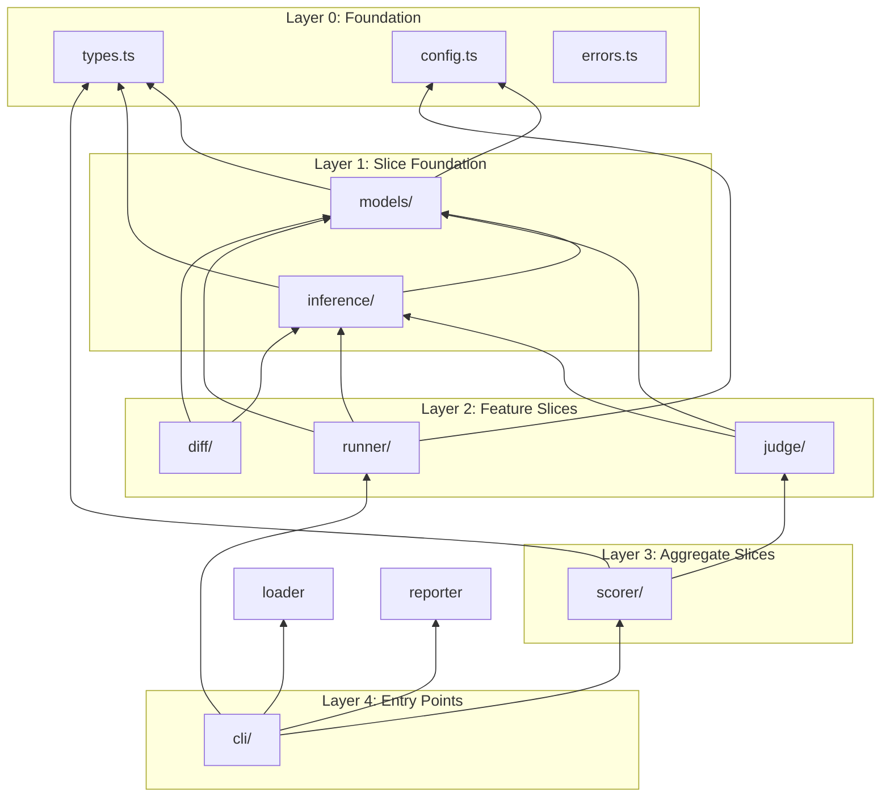

# Vertical Slice Architecture Refactor

## Overview

Refactor `packages/eval` from layered architecture to Vertical Slice Architecture (VSA) while migrating from `openai` package to `@mariozechner/pi-ai`.

## Current State Problems

| Problem | Current | VSA Target |
|---------|---------|------------|
| LLM client creation | 4 files each create OpenAI client | Unified inference slice |
| Layered thinking | `utils/` = tools layer | Slice-internal implementation |
| Config coupling | `env.ts` mixes 4 responsibilities | Per-slice config entry |
| Unclear ownership | `model-registry/` empty, role unclear | First-class `models/` slice |
| `plain.ts` bloat | MCP + OpenAI + loop in one file | Extracted `mcp.ts`, focused `plain.ts` |

## Target Architecture

```
packages/eval/src/
├── models/                      # Slice: Model Configuration
│   ├── index.ts               # public API
│   ├── registry.ts            # models.json loader + var resolver
│   └── types.ts               # ModelConfig, ModelRegistry
│
├── inference/                  # Slice: LLM Inference (pi-ai wrapper)
│   ├── index.ts               # public API
│   ├── stream.ts              # unified streaming interface
│   └── types.ts               # StreamOptions, etc.
│
├── judge/                      # Slice: LLM Judge
│   ├── index.ts               # export { callJudge, callMultiJudge }
│   ├── call.ts                # single model judge call
│   ├── multi.ts               # multi-model judge + aggregation
│   ├── aggregate.ts           # score aggregation algorithms
│   └── prompts/               # prompt templates
│       └── judge.ts
│
├── runner/                     # Slice: Agent Runner
│   ├── index.ts
│   ├── plain.ts               # pure LLM runner (orchestration only)
│   ├── agent.ts               # MCP + tools runner
│   ├── mcp.ts                 # MCP client lifecycle
│   └── types.ts               # McpTool, McpClient
│
├── diff/                       # Slice: Trace Comparison
│   ├── index.ts
│   └── compare.ts
│
├── scorer/                     # Slice: Scoring (aggregates other slices)
│   ├── index.ts
│   ├── registry.ts
│   ├── llm-judge.ts
│   ├── task-success.ts
│   ├── tool-parameter-accuracy.ts
│   ├── error-recovery.ts
│   ├── status.ts
│   ├── tool.ts
│   ├── human-review.ts
│   └── types.ts
│
├── cli/                        # Slice: CLI Entry Point
│   └── index.ts
│
├── loader/                     # (keep as-is)
├── reporter/                   # (keep as-is)
├── metrics/                    # (keep as-is)
├── cases/                      # (keep as-is)
├── online/                     # (keep as-is)
│
├── config.ts                   # Environment variables (simplified)
├── types.ts                    # Shared types
├── errors.ts                   # Shared errors
├── constants.ts                # Shared constants
└── index.ts                   # Package exports
```

## Dependency Graph



## File Migration Map

| Source | Target | Action |
|--------|--------|--------|
| (new) | `models/index.ts` | Create |
| (new) | `models/registry.ts` | Create |
| (new) | `models/types.ts` | Create |
| `models.json` (root) | `packages/eval/models.json` | Create |
| (new) | `inference/index.ts` | Create |
| (new) | `inference/stream.ts` | Create |
| (new) | `inference/types.ts` | Create |
| `utils/judge-client.ts` | `judge/call.ts` | Migrate + refactor |
| `utils/multi-judge-client.ts` | `judge/multi.ts` | Migrate + refactor |
| `utils/aggregate-scores.ts` | `judge/aggregate.ts` | Migrate |
| (new) | `judge/prompts/judge.ts` | Create |
| `runners/plain.ts` | `runner/plain.ts` | Refactor (extract MCP) |
| (new) | `runner/mcp.ts` | Extract from plain.ts |
| `runners/agent.ts` | `runner/agent.ts` | Move |
| `runners/types.ts` | `runner/types.ts` | Move |
| `runners/message-utils.ts` | `runner/message-utils.ts` | Move |
| `runners/normalize-agent-input.ts` | `runner/normalize-agent-input.ts` | Move |
| `runners/auto-followup.ts` | `runner/auto-followup.ts` | Move |
| `scorers/diff.ts` | `diff/compare.ts` | Move + refactor |
| (new) | `diff/index.ts` | Create |
| `env.ts` | `config.ts` | Simplify, move model config to models/ |
| `cli.ts` | `cli/index.ts` | Move |
| `cli-shared.ts` | `cli/shared.ts` | Move |

**Delete after migration:**
- `utils/judge-client.ts`
- `utils/multi-judge-client.ts`
- `utils/model-registry/`
- `utils/aggregate-scores.ts`
- `runners/` (moved to `runner/`)
- `scorers/diff.ts` (moved to `diff/`)

## Slice Specifications

### models/

**Purpose:** Single source of truth for model configuration.

```typescript
// models/index.ts
export { resolveModel, listModels, loadModels } from './registry.ts';
export type { ModelConfig, ModelRegistry } from './types.ts';
```

```typescript
// models/registry.ts
import { readFile } from 'node:fs/promises';
import { resolve } from 'node:path';
import type { ModelConfig, ModelRegistry } from './types.ts';

let registry: ModelRegistry | null = null;

export async function loadModels(path?: string): Promise<ModelRegistry> {
  const modelsPath = path ?? process.env.EVAL_MODELS_PATH ?? 'models.json';
  const content = await readFile(resolve(modelsPath), 'utf-8');
  const raw = JSON.parse(content);
  
  // Resolve ${VAR} in baseUrl and headers
  for (const [id, model] of Object.entries(raw.models)) {
    model.baseUrl = resolveEnvVars(model.baseUrl);
    if (model.headers) {
      for (const [k, v] of Object.entries(model.headers)) {
        model.headers[k] = resolveEnvVars(v);
      }
    }
  }
  
  registry = raw;
  return registry;
}

export function resolveModel(id: string): ModelConfig {
  if (!registry) throw new Error('Models not loaded. Call loadModels() first.');
  const model = registry.models[id];
  if (!model) throw new Error(`Model not found: ${id}`);
  return model;
}

export function listModels(): string[] {
  if (!registry) throw new Error('Models not loaded. Call loadModels() first.');
  return Object.keys(registry.models);
}

function resolveEnvVars(str: string): string {
  return str.replace(/\$\{(\w+)\}/g, (_, name) => process.env[name] ?? '');
}
```

```typescript
// models/types.ts
export interface ModelConfig {
  id: string;
  name: string;
  api: 'openai-completions' | 'anthropic-messages' | string;
  provider: string;
  baseUrl: string;
  reasoning?: boolean;
  input?: ('text' | 'image')[];
  cost?: {
    input: number;
    output: number;
    cacheRead?: number;
    cacheWrite?: number;
  };
  contextWindow?: number;
  maxTokens?: number;
  headers?: Record<string, string>;
}

export interface ModelRegistry {
  $schema?: string;
  models: Record<string, ModelConfig>;
}
```

### inference/

**Purpose:** Unified LLM inference interface over pi-ai.

```typescript
// inference/index.ts
export { stream, complete } from './stream.ts';
export type { StreamOptions } from './types.ts';
```

```typescript
// inference/stream.ts
import { stream as piStream, type Context } from '@mariozechner/pi-ai';
import type { ModelConfig } from '../models/index.ts';
import type { StreamOptions } from './types.ts';

export async function* stream(
  model: ModelConfig,
  context: Context,
  options?: StreamOptions,
): AsyncGenerator<string> {
  const piModel = {
    id: model.id,
    api: model.api,
    baseUrl: model.baseUrl,
    headers: model.headers,
  };
  
  const eventStream = piStream(piModel, context, {
    temperature: options?.temperature,
    maxTokens: options?.maxTokens,
  });
  
  for await (const event of eventStream) {
    if (event.type === 'text_delta') {
      yield event.delta;
    }
  }
}

export async function complete(
  model: ModelConfig,
  context: Context,
  options?: StreamOptions,
): Promise<string> {
  let content = '';
  for await (const chunk of stream(model, context, options)) {
    content += chunk;
  }
  return content;
}
```

```typescript
// inference/types.ts
export interface StreamOptions {
  temperature?: number;
  maxTokens?: number;
  responseFormat?: { type: 'json_object' };
}
```

### judge/

**Purpose:** LLM-based evaluation scoring.

```typescript
// judge/index.ts
export { callJudge } from './call.ts';
export { callMultiJudge, isMultiJudgeConfigured } from './multi.ts';
export { aggregateScores, calcConfidence, formatAggregatedReason } from './aggregate.ts';
export type { JudgeResult, JudgeError } from './call.ts';
export type { AggregationMethod, AggregatedResult, JudgeScore } from './aggregate.ts';
```

```typescript
// judge/call.ts
import { resolveModel } from '../models/index.ts';
import { complete } from '../inference/index.ts';
import type { Context } from '@mariozechner/pi-ai';
import { safeParseJson } from '../utils/safe-parse-json.ts';

export interface JudgeResult {
  score: number;
  reason: string;
}

export interface JudgeError {
  error: string;
}

export async function callJudge(
  modelId: string,
  systemPrompt: string,
  userPrompt: string,
  retries = 1,
): Promise<JudgeResult | JudgeError> {
  const model = resolveModel(modelId);
  
  for (let attempt = 0; attempt <= retries; attempt++) {
    try {
      const context: Context = {
        systemPrompt,
        messages: [{ role: 'user', content: userPrompt }],
      };
      
      const content = await complete(model, context, {
        temperature: 0,
        responseFormat: { type: 'json_object' },
      });
      
      const parsed = safeParseJson<{ score: number; reason: string }>(content);
      if (!parsed) {
        continue;
      }
      
      if (typeof parsed.score !== 'number' || parsed.score < 0 || parsed.score > 1) {
        continue;
      }
      
      if (typeof parsed.reason !== 'string') {
        continue;
      }
      
      return { score: parsed.score, reason: parsed.reason };
    } catch (error) {
      const message = error instanceof Error ? error.message : String(error);
      if (attempt === retries) {
        return { error: `Judge failed: ${message}` };
      }
    }
  }
  
  return { error: 'Judge failed after retries' };
}
```

### runner/

**Purpose:** Execute eval cases against LLM.

```typescript
// runner/mcp.ts
import { Client } from '@modelcontextprotocol/sdk/client/index.js';
import { StreamableHTTPClientTransport } from '@modelcontextprotocol/sdk/client/streamableHttp.js';

export interface McpClient {
  listTools(): Promise<McpTool[]>;
  callTool(name: string, args: Record<string, unknown>, timeout?: number): Promise<unknown>;
  close(): Promise<void>;
}

export interface McpTool {
  name: string;
  description?: string;
  inputSchema: Record<string, unknown>;
}

export async function createMcpClient(
  baseUrl: string,
  token?: string,
): Promise<McpClient> {
  const client = new Client({ name: 'eval-runner', version: '0.0.1' });
  
  const transport = new StreamableHTTPClientTransport(
    new URL(`${baseUrl}/mcp`),
    token ? { requestInit: { headers: { 'x-token': token } } } : undefined,
  );
  
  await client.connect(transport);
  
  return {
    async listTools() {
      const result = await client.listTools();
      return result.tools.map(t => ({
        name: t.name,
        description: t.description,
        inputSchema: t.inputSchema as Record<string, unknown>,
      }));
    },
    
    async callTool(name: string, args: Record<string, unknown>, timeout = 300_000) {
      const result = await client.callTool(
        { name, arguments: args },
        undefined,
        { timeout },
      );
      return result.content;
    },
    
    async close() {
      await client.close();
    },
  };
}
```

### diff/

**Purpose:** Compare two traces for the same case.

```typescript
// diff/compare.ts
import { resolveModel } from '../models/index.ts';
import { complete } from '../inference/index.ts';
import type { Context } from '@mariozechner/pi-ai';
import type { DiffResult, DiffVerdict, EvalCase, EvalTrace } from '../types.ts';
import { safeParseJson } from '../utils/safe-parse-json.ts';

export async function compareTraces(
  evalCase: EvalCase,
  base: EvalTrace,
  candidate: EvalTrace,
  baseLabel: string,
  candidateLabel: string,
): Promise<DiffResult> {
  const modelId = process.env.EVAL_JUDGE_MODEL;
  if (!modelId) {
    return {
      case_id: evalCase.id,
      verdict: 'error',
      reason: 'missing EVAL_JUDGE_MODEL',
      base,
      candidate,
    };
  }
  
  const model = resolveModel(modelId);
  
  const systemPrompt = `你是一个 AI 行为评估专家。对比以下两次运行，判断哪次更好地完成了任务。
只输出 JSON: {"verdict": "base_better"|"candidate_better"|"equivalent", "reason": "..."}`;

  const userPrompt = `## 任务描述
${evalCase.description}

## Base（${baseLabel}）
${formatTrace(base)}

## Candidate（${candidateLabel}）
${formatTrace(candidate)}`;

  const context: Context = {
    systemPrompt,
    messages: [{ role: 'user', content: userPrompt }],
  };
  
  try {
    const content = await complete(model, context, { temperature: 0 });
    const parsed = safeParseJson<{ verdict: string; reason: string }>(content);
    
    if (parsed && ['base_better', 'candidate_better', 'equivalent'].includes(parsed.verdict)) {
      return {
        case_id: evalCase.id,
        verdict: parsed.verdict as DiffVerdict,
        reason: parsed.reason,
        base,
        candidate,
      };
    }
  } catch {
    // fallthrough
  }
  
  return {
    case_id: evalCase.id,
    verdict: 'error',
    reason: 'Failed to get diff verdict',
    base,
    candidate,
  };
}
```

## config.ts (Simplified)

```typescript
// config.ts
export const ENV_KEYS = {
  // Model configuration
  MODELS_PATH: 'EVAL_MODELS_PATH',
  JUDGE_MODEL: 'EVAL_JUDGE_MODEL',
  
  // Runner
  OPENAI_BASE_URL: 'OPENAI_BASE_URL',
  OPENAI_API_KEY: 'OPENAI_API_KEY',
  OPENAI_X_TOKEN: 'OPENAI_X_TOKEN',
  
  // MCP
  MCP_SERVER_BASE_URL: 'EVAL_MCP_SERVER_BASE_URL',
  MCP_X_TOKEN: 'EVAL_MCP_X_TOKEN',
  
  // Upstream
  UPSTREAM_BASE_URL: 'EVAL_UPSTREAM_API_BASE_URL',
  UPSTREAM_X_TOKEN: 'EVAL_UPSTREAM_X_TOKEN',
  
  // Legacy
  LEGACY_AGENT_PROMPT_FILE: 'EVAL_LEGACY_AGENT_PROMPT_FILE',
} as const;

function readEnv(key: string): string | undefined {
  const value = process.env[key];
  return value?.trim() || undefined;
}

// Model config
export const getModelsPath = () => readEnv(ENV_KEYS.MODELS_PATH);
export const getJudgeModel = () => readEnv(ENV_KEYS.JUDGE_MODEL);

// Runner config
export const getRunnerBaseUrl = () => readEnv(ENV_KEYS.OPENAI_BASE_URL);
export const getRunnerApiKey = () => readEnv(ENV_KEYS.OPENAI_API_KEY);
export const getRunnerXToken = () => readEnv(ENV_KEYS.OPENAI_X_TOKEN);

// MCP config
export const getMcpBaseUrl = () => readEnv(ENV_KEYS.MCP_SERVER_BASE_URL);
export const getMcpXToken = () => readEnv(ENV_KEYS.MCP_X_TOKEN);

// Upstream config
export const getUpstreamBaseUrl = () => readEnv(ENV_KEYS.UPSTREAM_BASE_URL);
export const getUpstreamXToken = () => readEnv(ENV_KEYS.UPSTREAM_X_TOKEN);
```

## Test Migration Map

| Source | Target | Action |
|--------|--------|--------|
| `tests/judge-client.test.ts` | `tests/judge.test.ts` | Migrate |
| `tests/multi-judge.test.ts` | `tests/judge-multi.test.ts` | Migrate |
| `tests/plain-runner-config.test.ts` | `tests/runner.test.ts` | Migrate |
| (new) | `tests/models.test.ts` | Create |
| (new) | `tests/inference.test.ts` | Create |
| (new) | `tests/diff.test.ts` | Create |

## Execution Phases

### Phase 1: Foundation (Day 1) ✅ COMPLETE

1. Create `models/` slice
   - [x] `models/types.ts`
   - [x] `models/registry.ts`
   - [x] `models/index.ts`
   - [x] `packages/eval/models.json`
   - [x] `packages/eval/models.schema.json`

2. Create `inference/` slice
   - [x] `inference/types.ts`
   - [x] `inference/stream.ts`
   - [x] `inference/index.ts`

3. Write unit tests
   - [x] `tests/models.test.ts`
   - [x] `tests/inference.test.ts`

### Phase 2: Feature Slices (Day 2) ✅ COMPLETE

1. Create `judge/` slice
   - [x] `judge/aggregate.ts` (migrate from `utils/aggregate-scores.ts`)
   - [x] `judge/call.ts` (migrate from `utils/judge-client.ts`)
   - [x] `judge/multi.ts` (migrate from `utils/multi-judge-client.ts`)
   - [x] `judge/prompts/judge.ts` (SKIPPED - prompts inline in scorers, YAGNI)
   - [x] `judge/index.ts`

2. Create `runner/` slice
   - [x] `runner/mcp.ts` (extract from `runners/plain.ts`)
   - [x] `runner/plain.ts` (refactor to use `inference/`)
   - [x] `runner/agent.ts` (move from `runners/agent.ts`)
   - [x] `runner/types.ts`
   - [x] `runner/index.ts`

3. Create `diff/` slice
   - [x] `diff/compare.ts` (migrate from `scorers/diff.ts`)
   - [x] `diff/index.ts`

4. Migrate tests
   - [x] `tests/judge.test.ts`
   - [x] `tests/runner.test.ts`
   - [x] `tests/diff.test.ts`

### Phase 3: Aggregation + Entry Points (Day 3) ✅ COMPLETE

1. Update `scorer/` slice
   - [x] Update imports to use `judge/` slice
   - [x] Update `scorers/llm-judge.ts` to use `judge/call.ts`

2. Simplify config
   - [x] Create `config.ts` (simplified from `env.ts`)
   - [x] Update all imports from `env.ts` to `config.ts`

3. Move CLI
   - [x] `cli/index.ts` (move from `cli.ts`)
   - [x] `cli/shared.ts` (move from `cli-shared.ts`)

4. Cleanup
   - [x] Delete `utils/judge-client.ts`
   - [x] Delete `utils/multi-judge-client.ts`
   - [x] Delete `utils/aggregate-scores.ts`
   - [x] Delete `utils/model-registry/`
   - [x] Delete `runners/` directory
   - [x] Delete `scorers/diff.ts`
   - [x] Delete `env.ts`

5. Full test pass
   - [x] Run all tests
   - [x] Fix broken imports
   - [ ] Integration test with real eval run

## Risk Mitigation

| Risk | Mitigation |
|------|------------|
| Git history loss | Use `git mv` for all file moves |
| Tests fail during migration | Keep old files until new tests pass |
| CLI can't find modules | Update `cli/` last, fix all imports |
| pi-ai API incompatibility | Adapt in `inference/` layer |
| Circular dependencies | Follow dependency graph strictly |

## Validation Checklist

- [x] `pnpm build` succeeds
- [x] `pnpm test` passes
- [ ] `pnpm agent-eval run cases/` works with `models.json`
- [ ] Multi-judge works with multiple models
- [ ] Diff comparison works
- [x] All imports point to new locations
- [x] No circular dependencies